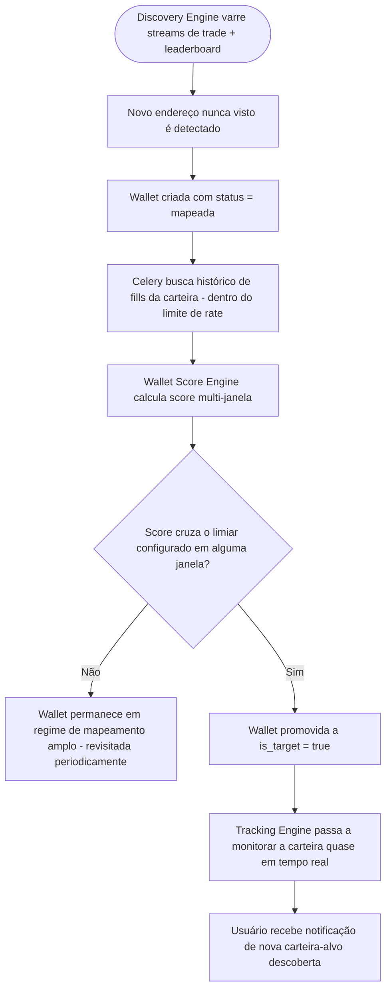
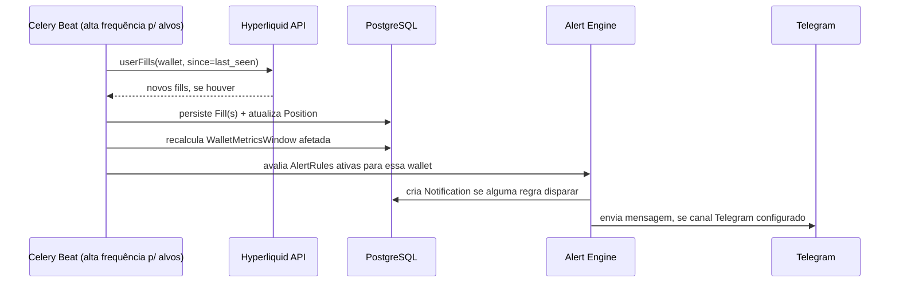
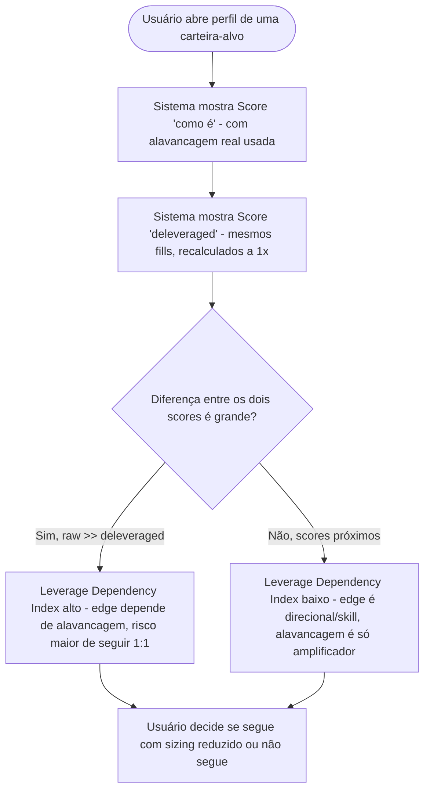
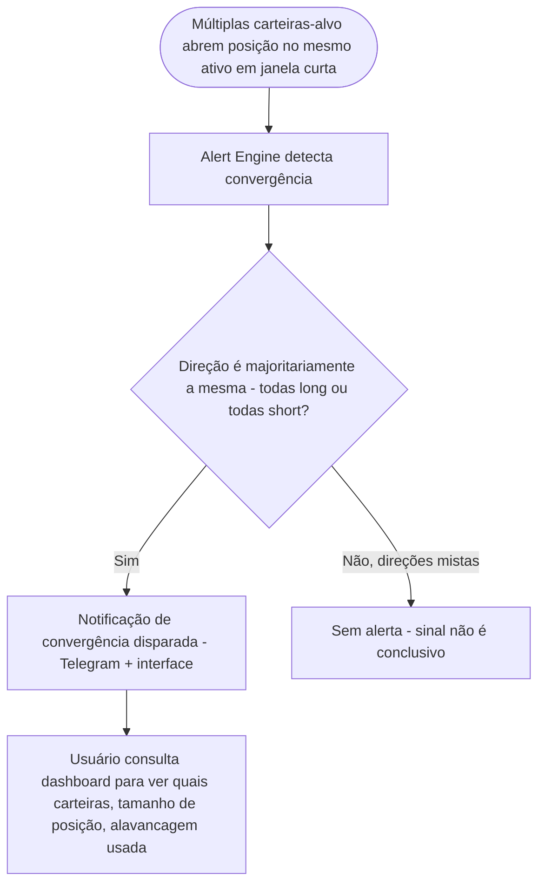
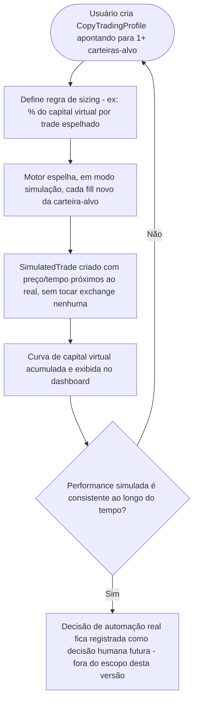
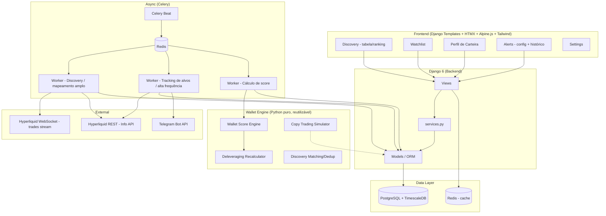
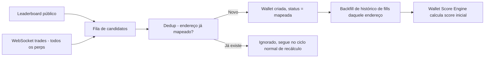
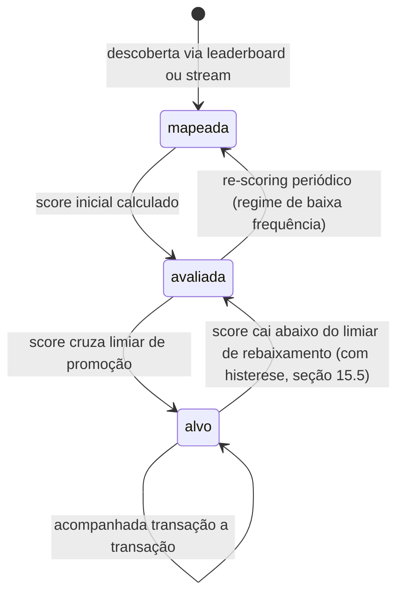

# PRD - SMR: Smart Money Radar — Inteligência e Score de Carteiras Hyperliquid

> **Versão:** 1.0
> **Data:** 2026-07-20
> **Status:** Aprovado para desenvolvimento
> **Nome do projeto:** sugestão de trabalho — **SMR (Smart Money Radar)**. Ajustável; todo o documento usa `SMR` como placeholder de nome, trocável por find-and-replace sem impacto estrutural.
> **Relação com outros projetos:** módulo **independente** (repositório, banco e deploy próprios) do ecossistema pessoal do usuário. Constrói **pontes de integração com o TMT** (seção 20), mas essas pontes nascem **desligadas por padrão** — nenhuma automação cruza de um sistema pro outro sem ativação explícita futura.
> **Domínio de produção sugerido:** `smr.trade` (ajustável)
> **Stack núcleo:** Python 3.13+ · Django 6.0+ · PostgreSQL 16 + TimescaleDB · Celery + Redis · Docker Swarm + Traefik · Hyperliquid Public API (REST + WebSocket) · pandas / numpy · Plotly

---

## Sobre este documento

Este PRD segue a mesma convenção do `PRD_TMT.md`: fonte única de verdade, seções nunca diminuem, citar `@PRD_SMR.md` em prompts de execução de sprint. Português para UI/negócio, inglês para nomes técnicos, Mermaid para diagramas, checkboxes para sprints.

---

## Índice

1. [Visão Geral do Produto](#1-visão-geral-do-produto)
2. [Objetivos do Sistema](#2-objetivos-do-sistema)
3. [Escopo do Projeto](#3-escopo-do-projeto)
4. [Público-Alvo](#4-público-alvo)
5. [Principais Jornadas de Usuário](#5-principais-jornadas-de-usuário)
6. [Personas e Perfis de Acesso](#6-personas-e-perfis-de-acesso)
7. [Regras Gerais do Sistema](#7-regras-gerais-do-sistema)
8. [Arquitetura Geral da Aplicação](#8-arquitetura-geral-da-aplicação)
9. [Motor de Descoberta de Carteiras](#9-motor-de-descoberta-de-carteiras)
10. [Stack Técnica Obrigatória](#10-stack-técnica-obrigatória)
11. [Estrutura Recomendada do Projeto Django](#11-estrutura-recomendada-do-projeto-django)
12. [Apps Django Recomendadas](#12-apps-django-recomendadas)
13. [Modelagem de Domínio](#13-modelagem-de-domínio)
14. [Entidades Principais do Sistema](#14-entidades-principais-do-sistema)
15. [Wallet Score Engine](#15-wallet-score-engine)
16. [Acompanhamento Transação a Transação](#16-acompanhamento-transação-a-transação)
17. [Sistema de Alertas](#17-sistema-de-alertas)
18. [Dashboard e Navegação (UI/UX)](#18-dashboard-e-navegação-uiux)
19. [Motor de Copy Trading (Construído com Modo Live)](#19-motor-de-copy-trading-construído-com-modo-live)
20. [Ponte com o TMT (Construída, Não Conectada)](#20-ponte-com-o-tmt-construída-não-conectada)
21. [Requisitos Não Funcionais](#21-requisitos-não-funcionais)
22. [Regras de Qualidade de Código](#22-regras-de-qualidade-de-código)
23. [Variáveis de Ambiente](#23-variáveis-de-ambiente)
24. [Docker e Deploy](#24-docker-e-deploy)
25. [Estratégia de Banco de Dados e Escala](#25-estratégia-de-banco-de-dados-e-escala)
26. [Backup](#26-backup)
27. [Logs e Monitoramento](#27-logs-e-monitoramento)
28. [Riscos Técnicos e de Dados](#28-riscos-técnicos-e-de-dados)
29. [Decisões Técnicas Recomendadas](#29-decisões-técnicas-recomendadas)
30. [Critérios de Aceite](#30-critérios-de-aceite)
31. [Roadmap de Desenvolvimento](#31-roadmap-de-desenvolvimento)
32. [Sprints de Implementação em Checklist](#32-sprints-de-implementação-em-checklist)
33. [Considerações Finais](#33-considerações-finais)

---

## 1. Visão Geral do Produto

### 1.1 Descrição

O **SMR (Smart Money Radar)** é uma plataforma de **mapeamento, avaliação e acompanhamento de carteiras da Hyperliquid**. O sistema varre o universo de endereços que operam contratos perpétuos na Hyperliquid, avalia cada carteira transação a transação e calcula um **Wallet Score** — uma pontuação objetiva de qualidade de trade que leva em conta volume de amostragem, win rate, PnL, drawdown, consistência e uma leitura estratégica específica sobre alavancagem (rating "como é" vs. rating "sem alavancagem", seção 15.4). Carteiras que cruzam um score mínimo viram **carteiras-alvo**, promovidas a um regime de acompanhamento de alta frequência, praticamente transação a transação, com alertas em tempo real via Telegram e interface.

### 1.2 Problema que Resolve

Hoje, identificar boas carteiras pra seguir na Hyperliquid depende de ferramentas de terceiros (ex: HyperX) com critério de score fechado, não auditável, e sem cruzamento com a metodologia de risco que o usuário já usa nos outros sistemas (TMT). Não existe hoje um funil próprio que vá do **universo bruto de carteiras** até uma **lista curada, pontuada e auditável** de carteiras realmente dignas de acompanhamento, nem um jeito de separar "esse trader é bom porque entende o mercado" de "esse trader só está tomando risco desproporcional e ainda não quebrou".

### 1.3 Proposta de Valor

| Para | Valor entregue |
|---|---|
| **Descoberta de smart money** | Mapeamento amplo (não só top-N de leaderboard público) + score próprio, auditável, com breakdown por componente |
| **Separar sorte/risco de habilidade** | Rating dual (com e sem alavancagem) isola o quanto do resultado de um trader vem de gestão de risco/skill vs. de estar simplesmente mais alavancado |
| **Acompanhamento acionável** | Carteiras-alvo monitoradas quase em tempo real, com alerta imediato de nova posição, fechamento, ou convergência de várias carteiras boas no mesmo ativo |
| **Disciplina antes de automação** | Motor de copy trading já desenhado e simulável (paper), mas **deliberadamente não conectado** a execução real — mesma filosofia paper-first do TMT |
| **Extensível** | Ponte de dados pronta para, no futuro, alimentar o Exhaustion/Capitulation Score do TMT com um componente de "smart money" — sem acoplamento hoje |

---

## 2. Objetivos do Sistema

### 2.1 Objetivos de Produto

- Mapear o universo de carteiras ativas na Hyperliquid "na raça" — não depender só do leaderboard oficial (que cobre um recorte limitado).
- Avaliar cada carteira mapeada com um score objetivo, multi-janela (24h/7d/30d/90d/180d — all-time em V2).
- Isolar o efeito da alavancagem na performance de cada trader através de um rating dual.
- Selecionar automaticamente carteiras-alvo (score acima de limiar) e acompanhá-las transação a transação.
- Alertar em tempo real (Telegram + interface) sobre atividade relevante dessas carteiras.
- Deixar prontas, mas desconectadas, as pontes para (a) copy trading real e (b) alimentar o TMT com sinal de smart money.

### 2.2 Objetivos Técnicos

- Suportar escala potencialmente grande de endereços (dezenas a centenas de milhares) sem estourar rate limit da API pública da Hyperliquid, através de **dois regimes de ingestão** com frequência diferente (mapeamento amplo vs. acompanhamento de alvo — seção 8.3).
- Garantir que o score seja recalculável de forma determinística a partir do histórico bruto de fills armazenado (auditável, reproduzível — mesmo princípio de "motor único" do TMT).
- Persistir dados brutos suficientes (fills, não só métricas agregadas) para permitir reprocessamento do score caso a metodologia mude.
- Arquitetura pronta para, no futuro, ligar a ponte com o TMT e/ou habilitar copy trading real, sem exigir redesenho — apenas troca de flag + implementação do conector final.

### 2.3 Metas Mensuráveis (referência para Critérios de Aceite — seção 30)

- Toda `Wallet` marcada como alvo (`is_target=True`) tem fills novos refletidos no sistema em até poucos minutos da execução real na Hyperliquid.
- Todo `WalletScore` é rastreável até o `component_breakdown` e até os `Fill`s brutos que o originaram.
- O rating "sem alavancagem" é calculado a partir dos mesmos fills brutos do rating "como é" — nunca são fontes de dado diferentes.
- Nenhuma ordem de copy trading real é executada quando `HL_LIVE_EXECUTION=False` (padrão). O `DryRunExecutor` é sempre instanciado sem a flag explícita (seção 19.4).
- Nenhuma chamada é feita do TMT para o SMR (ou vice-versa) fora de um teste manual explícito — a ponte existe como contrato de API, não como integração ativa.

---

## 3. Escopo do Projeto

### 3.1 Dentro do Escopo (V1)

- **Discovery Engine**: mapeamento amplo do universo de carteiras Hyperliquid via combinação de leaderboard público + captura de endereços a partir do stream público de trades por ativo (seção 9).
- **Wallet Score Engine**: score multi-componente, multi-janela (24h/7d/30d/90d/180d), com rating duplo (alavancado "como é" vs. deleveraged) — seção 15.
- **Promoção a carteira-alvo**: regra de corte de score (configurável) que move uma carteira do regime de mapeamento amplo para o regime de acompanhamento de alta frequência.
- **Tracking transação a transação** das carteiras-alvo: fills, posições abertas/fechadas, com granularidade quase real-time (seção 16).
- **Alertas** via Telegram + interface, cobrindo os 5 gatilhos definidos com o usuário (seção 17).
- **Dashboard** com navegação lateral (Discovery, Watchlist, Wallets, Alerts, Settings — seção 18), inspirado em densidade de informação do HyperX, sem clonar o layout.
- **Motor de Copy Trading em modo simulação (paper)** — mirror de trades de carteiras-alvo pra uma carteira virtual, permitindo avaliar "e se eu tivesse copiado esse cara" antes de qualquer decisão de automação real (seção 19).
- **Contrato de API de ponte com o TMT**, implementado, documentado, mas com flag de ativação desligada por padrão (seção 20).
- Deploy em VPS Ubuntu com Docker Swarm + Traefik (infraestrutura Hermes, mesmo padrão do TMT).
- **Suporte a HIP-3 (ações tokenizadas)** além de crypto perps — a Hyperliquid lista ações tokenizadas (DKNG, BX, COST, DELL, etc.) como perpetuals; o Discovery Engine e Score Engine devem suportar ambos os tipos de ativo.

### 3.2 Fora do Escopo (V1)

- **Execução real de copy trading** — o motor é construído (seção 19), mas o conector de execução real na Hyperliquid **não é implementado** nesta fase; existe apenas como stub/placeholder de arquitetura.
- **Conexão ativa da ponte com o TMT** — o endpoint existe e é testável isoladamente, mas nenhum dos dois sistemas chama o outro em produção nesta fase.
- **Cobertura de all-time nas métricas** — V1 cobre 24h/7d/30d/90d/180d; all-time fica pra V2 (exige estratégia de armazenamento/agregação de longuíssimo prazo).
- **Mapeamento 100% do universo de 500k+ carteiras simultaneamente** — V1 mapeia de forma contínua e incremental (mais carteiras entram no radar com o tempo), não pretende indexar tudo no dia 1.
- **Machine learning para score preditivo** — score é baseado em regras/pesos configuráveis (mesma filosofia do Exhaustion Score do TMT), não em modelo treinado.
- **Multi-chain** — escopo é exclusivamente Hyperliquid nesta fase.

### 3.3 Premissas e Restrições

- Toda credencial/endpoint sensível via `.env`, nunca commitado.
- A API pública da Hyperliquid não exige autenticação para os dados usados aqui (fills, posições, leaderboard, streams de trade são públicos) — nenhuma chave privada de terceiro é necessária ou armazenada para o modo observação.
- Timestamps sempre em UTC no armazenamento; conversão pra `America/Sao_Paulo` só na apresentação.
- Rate limits da Hyperliquid devem ser respeitados de forma conservadora (ver seção 9.3) — a exchange pode throttle/banir IP em caso de abuso; a arquitetura assume isso como restrição rígida, não como detalhe de implementação.

---

## 4. Público-Alvo

Sistema de uso pessoal (não SaaS), operado pelo mesmo perfil de usuário do TMT: trader tecnicamente avançado que quer **decisão apoiada em dado objetivo, auditável**, e que já tem disciplina de não pular direto para automação sem antes validar a tese em modo observação/simulação.

---

## 5. Principais Jornadas de Usuário

### 5.1 Jornada — Do Mapeamento Bruto à Carteira-Alvo



### 5.2 Jornada — Acompanhamento Transação a Transação



### 5.3 Jornada — Avaliar o Efeito da Alavancagem num Trader



### 5.4 Jornada — Convergência de Smart Money num Ativo



### 5.5 Jornada — Simular Copy Trading (Paper) Antes de Qualquer Decisão Real



---

## 6. Personas e Perfis de Acesso

Mesmo padrão de roles do TMT, reaproveitado por consistência:

| Role | Pode fazer | Não pode fazer |
|---|---|---|
| `admin` | Tudo: ajustar pesos do score, thresholds de promoção a alvo, configurar bridge (mesmo desligada), criar `CopyTradingProfile` | — |
| `operator` | Ver dashboard, gerenciar `AlertRule`, adicionar/remover carteiras manualmente da watchlist, rodar simulação de copy trading | Alterar pesos globais do score, ativar/desativar a ponte com o TMT |
| `viewer` | Ver dashboards, relatórios, perfis de carteira | Criar regras, alterar configuração |

---

## 7. Regras Gerais do Sistema

1. **Todo score é recalculável a partir do dado bruto.** `Fill` é a fonte de verdade; `WalletMetricsWindow` e `WalletScore` são sempre deriváveis (nunca editáveis manualmente).
2. **Rating "como é" e rating "deleveraged" usam a mesma base de fills.** Nunca há dois pipelines de dado diferentes — apenas duas funções de cálculo sobre a mesma entrada (mesmo princípio de motor único do TMT).
3. **Nenhuma ordem real é enviada por este sistema em nenhuma circunstância na V1.** O motor de copy trading (seção 19) roda exclusivamente em modo simulação; o conector de execução real não existe no código, apenas na arquitetura documentada.
4. **A ponte com o TMT nasce desligada.** `TMT_BRIDGE_ENABLED=False` por padrão (seção 20); nenhuma chamada automática cruza os dois sistemas sem ativação manual e deliberada, feita depois desta versão.
5. **Duas frequências de ingestão coexistem**: mapeamento amplo (baixa frequência, todo o universo conhecido) e acompanhamento de alvo (alta frequência, só carteiras promovidas). Uma carteira nunca é tratada nas duas frequências ao mesmo tempo.
6. **Toda `Wallet` promovida a alvo registra o motivo da promoção** (`promoted_reason`, `promoted_at`, `score_at_promotion`) — rastreabilidade de por que aquela carteira está sendo seguida.
7. **Rate limit da Hyperliquid é tratado como restrição rígida**, nunca contornada por paralelismo agressivo (seção 9.3).
8. **Toda `Notification` é auditável** e liga de volta ao evento de origem (fill, mudança de score, convergência).

---

## 8. Arquitetura Geral da Aplicação

### 8.1 Visão de Camadas



### 8.2 Princípios Arquiteturais

- Mesma filosofia do TMT: **motor de cálculo desacoplado do ORM** (`wallet_engine/`), views finas, services gordos.
- **Dois regimes de ingestão com filas Celery separadas** (`discovery` vs. `tracking`) para que o mapeamento amplo (pesado, mas não urgente) nunca atrase o acompanhamento de carteiras-alvo (leve por carteira, mas urgente).
- Tudo que toca a API da Hyperliquid é assíncrono; a interface nunca bloqueia esperando rede externa.

### 8.3 Os Dois Regimes de Ingestão

| Regime | Cobertura | Frequência | Fila Celery | Objetivo |
|---|---|---|---|---|
| **Mapeamento amplo (Discovery)** | Todo endereço já visto operando na Hyperliquid | Contínuo, mas de baixa prioridade/throughput por carteira (ex: métricas recalculadas a cada poucas horas/dias, conforme volume) | `discovery` | Achar carteiras novas e re-avaliar score de todo o universo mapeado, sem tentar acompanhar cada fill em tempo real |
| **Acompanhamento de alvo (Tracking)** | Só `Wallet.is_target=True` | Alta frequência (polling curto, ex: a cada 30-60s por carteira-alvo) | `tracking` | Capturar fills quase em tempo real e disparar alertas |

Esse desenho é o que resolve a tensão entre "mapear tudo" (dezenas/centenas de milhares de endereços) e "acompanhar transação a transação" (só viável em um subconjunto pequeno e curado) sem estourar rate limit.

---

## 9. Motor de Descoberta de Carteiras

### 9.1 Estratégia de Mapeamento ("ir na raça")

O Discovery Engine não depende só do endpoint de leaderboard (que cobre um recorte específico, geralmente por PnL/volume de um período). Ele combina três fontes:

1. **Leaderboard público da Hyperliquid** — ponto de partida rápido, carteiras já conhecidas como relevantes.
2. **Stream público de trades por ativo** (WebSocket `trades`) — a cada trade executado em qualquer perp listado, o campo `users` (array com maker + taker wallets) é capturado e enfileirado como candidato novo. **Confirmado via teste real**: o WebSocket retorna `{"coin":"BTC","side":"B","px":"...","sz":"...","users":["0x...maker","0x...taker"],...}`. Esse canal permite ir além do leaderboard e realmente "mapear tudo" que está operando, incluindo carteiras menores que ainda não apareceriam em nenhum ranking.
3. **Descoberta por vizinhança** (V2 candidato): a partir de uma carteira-alvo boa, inspecionar outros endereços que tenham interagido no mesmo período/ativo com padrão semelhante — não implementado na V1, documentado como extensão natural.



### 9.2 Backfill de Histórico

Ao mapear uma carteira nova, o sistema busca seu histórico de fills disponível via `userFills` (Info API), respeitando o limite de rate (seção 9.3), para poder calcular as janelas de 24h/7d/30d/90d/180d imediatamente, e não só a partir do momento da descoberta.

### 9.3 Rate Limiting e Boas Práticas de API

- A API pública da Hyperliquid opera por sistema de peso de requisição por IP/endereço; o SMR trata isso como **restrição rígida** — todas as chamadas passam por um limitador central (token bucket) compartilhado entre os workers `discovery` e `tracking`, com prioridade maior para `tracking` (carteiras-alvo nunca ficam sem dado por causa de um scan de mapeamento amplo rodando).
- Retry com backoff exponencial (`tenacity`) em toda chamada.
- **Nota de implementação:** os limites exatos de peso/requisição devem ser confirmados contra a documentação oficial da Hyperliquid no momento da implementação (podem mudar) — o limitador é parametrizável via `.env`, nunca hardcoded, para permitir ajuste sem deploy de código novo.
- Preferência por WebSocket (push) em vez de polling REST sempre que o dado permitir, reduzindo volume de requisição.

### 9.4 Ciclo de Vida de uma Wallet



---

## 10. Stack Técnica Obrigatória

Mesma stack-base do TMT, por consistência de ecossistema pessoal:

| Camada | Tecnologia | Justificativa |
|---|---|---|
| Linguagem | Python 3.13+ | Consistência com TMT, SCAR, CobrAI |
| Framework | Django 6.0+ | Admin nativo, ORM maduro |
| Banco | PostgreSQL 16 + TimescaleDB | Fills e métricas são séries temporais de alto volume |
| Fila/broker | Redis | Broker Celery + cache; mesma decisão do TMT (seção 39.2 do PRD_TMT) |
| Processamento assíncrono | Celery (worker + beat), com filas `discovery`/`tracking`/`scoring`/`alerts` | Isolamento entre mapeamento amplo e acompanhamento de alvo |
| Conectividade Hyperliquid | Cliente HTTP próprio sobre a Info API pública + WebSocket nativo (`websockets`/`aiohttp`) | Hyperliquid tem API própria (não é multi-exchange via CCXT como o TMT) |
| Cálculo numérico | pandas, numpy | Cálculo de métricas e score sobre séries de fills |
| WebSocket client | `websockets` (Python) | Consumo do stream `trades` em tempo real para Discovery Engine |
| Frontend | Django Templates + HTMX + Alpine.js + Tailwind | Consistência com o restante do ecossistema |
| Notificações | Telegram Bot API | Mesmo canal do TMT |
| Deploy | Docker Swarm + Traefik | Reaproveita VPS Hermes |

---

## 11. Estrutura Recomendada do Projeto Django

```
smr/
├── manage.py
├── requirements.txt
├── .env
├── smr/                     # settings, urls, celery.py
├── wallet_engine/            # motor puro Python - score, deleveraging, discovery matching, copy sim
│   ├── score.py
│   ├── deleveraging.py
│   ├── discovery.py
│   └── copy_simulator.py
├── hyperliquid_client/        # cliente HTTP/WS próprio da Info API
├── wallets/                    # Wallet, Fill, Position, WalletMetricsWindow, WalletScore
├── discovery/                   # tasks de mapeamento amplo
├── tracking/                    # tasks de acompanhamento de alvo
├── alerts/                      # AlertRule, Notification, integração Telegram
├── copytrading/                  # CopyTradingProfile, SimulatedTrade (paper apenas)
├── bridge/                       # contrato de API com o TMT (desligado por padrão)
├── dashboard/                    # views agregadas, KPIs
├── accounts/                     # User customizado, roles
└── docs/                         # MkDocs
```

---

## 12. Apps Django Recomendadas

| App | Responsabilidade |
|---|---|
| `accounts` | Usuário customizado, roles |
| `hyperliquid_client` | Cliente de baixo nível (REST + WS) da Info API pública, com rate limiter central |
| `wallets` | Modelo de domínio central: `Wallet`, `Fill`, `Position`, `WalletMetricsWindow`, `WalletScore` |
| `discovery` | Orquestra o mapeamento amplo (leaderboard + stream + dedup + backfill) |
| `tracking` | Orquestra o acompanhamento de alta frequência das carteiras-alvo |
| `alerts` | `AlertRule`, `Notification`, envio Telegram |
| `copytrading` | Simulação de copy trading (paper apenas) — seção 19 |
| `bridge` | Contrato de API de integração com o TMT, desligado por padrão — seção 20 |
| `dashboard` | Agregações e KPIs para as telas de Discovery/Watchlist |

---

## 13. Modelagem de Domínio

### 13.1 Diagrama ER (núcleo)

```mermaid
erDiagram
    WALLET ||--o{ FILL : executa
    WALLET ||--o{ POSITION : mantém
    WALLET ||--o{ WALLET_METRICS_WINDOW : gera
    WALLET ||--o{ WALLET_SCORE : gera
    WALLET ||--o{ WATCHLIST_ENTRY : referenciada_em
    WALLET ||--o{ ALERT_RULE : alvo_de
    ALERT_RULE ||--o{ NOTIFICATION : dispara
    USER ||--o{ WATCHLIST_ENTRY : cria
    USER ||--o{ ALERT_RULE : configura
    USER ||--o{ COPY_TRADING_PROFILE : cria
    COPY_TRADING_PROFILE ||--o{ COPY_TRADING_TARGET : segue
    WALLET ||--o{ COPY_TRADING_TARGET : é_seguida_em
    COPY_TRADING_PROFILE ||--o{ SIMULATED_TRADE : gera

    WALLET {
        string address
        datetime first_seen
        datetime last_seen
        string discovery_source
        bool is_target
        string promoted_reason
        datetime promoted_at
        bool is_active
    }
    FILL {
        fk wallet
        string asset
        string side
        decimal price
        decimal size
        decimal fee
        decimal closed_pnl
        datetime timestamp
        bool is_liquidation
        string oid
    }
    POSITION {
        fk wallet
        string asset
        string side
        decimal size
        decimal entry_price
        decimal leverage
        decimal liquidation_price
        decimal unrealized_pnl
        string status
        datetime opened_at
        datetime closed_at
    }
    WALLET_METRICS_WINDOW {
        fk wallet
        string window
        int total_trades
        decimal win_rate
        decimal total_pnl
        decimal roi_pct
        decimal avg_leverage
        decimal max_drawdown_pct
        decimal current_drawdown_pct
        decimal consistency_stddev
        decimal avg_risk_per_trade_pct
        decimal martingale_index
        decimal avg_holding_time_hours
        decimal diversification_index
        decimal market_correlation
    }
    WALLET_SCORE {
        fk wallet
        string window
        int score_raw
        int score_deleveraged
        decimal leverage_dependency_index
        json component_breakdown
        int rank
        datetime computed_at
    }
```

### 13.2 Models Abstratas Base

Reaproveita o mesmo padrão `BaseModel`/`TimeSeriesModel` do TMT (`created_at`/`updated_at` automáticos, `timestamp` indexado para séries temporais).

---

## 14. Entidades Principais do Sistema

### 14.1 Wallet

- `address` (único, endereço on-chain), `first_seen`, `last_seen`, `discovery_source` (`leaderboard`/`trade_stream`/`manual`), `is_target`, `promoted_reason`, `promoted_at`, `score_at_promotion`, `is_active`, `tags` (livre, ex: "memecoin specialist", "scalper").

### 14.2 Fill

- `wallet` (FK), `asset`, `side` (`buy`/`sell`), `price`, `size`, `fee`, `closed_pnl`, `timestamp`, `is_liquidation`, `oid` (identificador da ordem na Hyperliquid, para dedup). Fonte de verdade de todo o resto do sistema.

### 14.3 Position

- `wallet` (FK), `asset`, `side`, `size`, `entry_price`, `leverage`, `liquidation_price`, `unrealized_pnl`, `status` (`open`/`closed`), `opened_at`, `closed_at`. Reconstruída/atualizada a partir dos `Fill`s e de snapshots de `clearinghouseState`.

### 14.4 WalletMetricsWindow

Uma linha por `(wallet, window)`, recalculada periodicamente (alvo: alta frequência; mapeamento amplo: baixa frequência). Contém todas as métricas brutas que alimentam o score (seção 15): `total_trades`, `win_rate`, `total_pnl`, `roi_pct`, `avg_leverage`, `max_drawdown_pct`, `current_drawdown_pct`, `consistency_stddev`, `avg_risk_per_trade_pct`, `martingale_index`, `avg_holding_time_hours`, `diversification_index`, `market_correlation`.

### 14.5 WalletScore

Uma linha por `(wallet, window, computed_at)` — histórico preservado, nunca sobrescrito (mesmo princípio de imutabilidade do `ExhaustionScore` no TMT). Contém `score_raw`, `score_deleveraged`, `leverage_dependency_index`, `component_breakdown` (JSON), `rank` (posição relativa no universo mapeado naquela janela).

### 14.6 WatchlistEntry

- `user`, `wallet`, `added_at`, `notes`, `added_manually` (bool — diferencia adição manual de promoção automática por score).

### 14.7 AlertRule / Notification

- `AlertRule`: `user`, `wallet` (nulo = todas as carteiras-alvo), `condition_type` (`new_position`/`position_closed`/`score_threshold_cross`/`convergence`/`asset_specific`), `asset_filter` (opcional, ex: só memecoins do radar do TMT), `threshold`, `channel` (`telegram`/`interface`/`ambos`).
- `Notification`: mesmo padrão do TMT — `title`, `body`, `level`, `read`, referência genérica ao evento de origem.

### 14.8 CopyTradingProfile / CopyTradingTarget / SimulatedTrade

Ver seção 19 — modelagem completa do motor de simulação (paper only).

---

## 15. Wallet Score Engine

Vive em `wallet_engine/score.py`, funções puras (recebem `DataFrame` de fills + metadados de janela, devolvem score + breakdown) — mesmo princípio de motor desacoplado do TMT.

**Nota sobre dados de fill:** A API `userFills` retorna no máximo 2000 fills por chamada, e apenas os 10000 mais recentes estão disponíveis. Para traders de alta frequência (ex: traders HIP-3 de ações tokenizadas que geram centenas de fills/dia), o backfill de histórico pode ser incompleto. Mitigação: para carteiras em regime de tracking (`is_target=True`), o sistema acumula fills incrementalmente via polling, garantindo cobertura completa a partir do momento da promoção.

### 15.1 Componentes do Score

| Componente | Peso máximo | Critério de pontuação |
|---|---|---|
| **Amostragem (quantidade de trades)** | 10 | Escala logarítmica — mais trades aumenta a confiança na amostra, mas com retorno decrescente (ex: `min(10, log(total_trades) * k)`), pra não deixar um trader com 3 trades "sortudos" competir de igual pra igual com um com 300 |
| **Win rate** | 15 | Proporcional direto, ajustado pelo número de trades (win rate de amostra pequena pesa menos — combinação com o componente de amostragem) |
| **PnL / ROI%** | 20 | Combina PnL absoluto normalizado pelo capital médio usado no período **e** ROI% — evita que uma baleia com PnL alto em termos absolutos, mas ROI% medíocre, pareça melhor que realmente é |
**Nota (ajuste pós-validação):** ROI% foi removido do cálculo por ambiguidade na derivação a partir de fills históricos (capital no momento de cada fill não é diretamente disponível via API). O componente usa **PnL absoluto** normalizado pela `accountValue` mais recente como proxy. Essa simplificação é mais confiável e auditável que tentar reconstruir equity curve histórica imprecisa.
| **Drawdown (máximo e atual)** | 15 | Penaliza — quanto maior o drawdown máximo da janela e quanto mais perto o drawdown atual estiver do máximo histórico, menor a pontuação |
| **Consistência** | 15 | Desvio-padrão dos retornos diários dentro da janela — resultado errático (poucos trades gigantes, resto neutro) pontua pior que ganho distribuído de forma mais regular |
| **Risco por trade (sizing)** | 10 | Mede se o tamanho médio de posição vs. equity é razoável e estável — pune padrão de "aposta tudo numa entrada só" |
| **Comportamento martingale** | 5 | Penaliza padrão de aumentar posição perdedora (average down repetido em direção contrária ao preço) — sinal de gestão de risco ruim mesmo com PnL positivo no momento |
| **Diversificação de ativos** | 5 | Pontua trader que opera mais de um ativo com resultado positivo, vs. quem só teve sorte num único par |
| **Correlação com regime de mercado** | 5 | Compara performance do trader em janelas de alta, baixa e lateralização do mercado geral (proxy: BTC ou índice interno) — quem só ganha em bull run pontua pior que quem sustenta resultado em regimes diferentes |

**Total: 100 pontos.** Este é o **score base**, calculado igual nas duas versões (raw e deleveraged) — a diferença entre as duas versões está em **como os componentes de PnL/ROI e Drawdown são recalculados** (seção 15.4), não em pesos diferentes.

### 15.2 Multi-Janela

Todo score é calculado, independentemente, para as janelas `24h`, `7d`, `30d`, `90d`, `180d` (all-time fica pra V2 — seção 3.2). Isso permite ver tanto quem está "quente" agora (24h/7d) quanto quem tem consistência de mais longo prazo (90d/180d) — e comparar as duas leituras da mesma carteira lado a lado.

### 15.3 Classificação por Faixa (mesmo padrão do TMT, por consistência)

| Faixa de score | Classificação |
|---|---|
| 0–39 | `fraco` |
| 40–59 | `mediano` |
| 60–74 | `bom` |
| 75–100 | `elite` |

### 15.4 Rating Dual: "Como É" vs. "Deleveraged"

Esse é o tratamento estratégico da alavancagem pedido pelo usuário: alavancagem **não entra como um componente de peso fixo no score** — em vez disso, o score inteiro é calculado **duas vezes** sobre os mesmos fills brutos:

- **`score_raw`**: usa PnL, ROI% e drawdown exatamente como aconteceram, com a alavancagem real que o trader usou.
- **`score_deleveraged`**: recalcula PnL, ROI% e drawdown **normalizando toda posição para 1x** — ou seja, reconstrói o retorno percentual do preço do ativo entre entrada e saída de cada fill, e aplica esse retorno sobre o capital como se nenhuma alavancagem tivesse sido usada, preservando o mesmo timing e direção de entrada/saída.

```
retorno_pct_preço = (preço_saída − preço_entrada) / preço_entrada × sinal(direção)
pnl_deleveraged   = capital_alocado_1x × retorno_pct_preço
```

A partir dos dois scores, calcula-se o **Leverage Dependency Index**:

```
leverage_dependency_index = (score_raw − score_deleveraged) / max(score_raw, 1)
```

| Leitura | Interpretação |
|---|---|
| Índice baixo (scores próximos) | O edge do trader é majoritariamente **direcional/skill** — alavancagem é só um amplificador do que ele já acertaria de qualquer forma. Mais seguro de seguir/copiar. |
| Índice alto (raw >> deleveraged) | O resultado depende fortemente de estar mais alavancado que o normal — o mesmo trader, sem alavancagem, teria performance mediana. Seguir esse padrão exige sizing próprio bem mais conservador, ou não seguir. |

Esse índice é recalculado por janela, permitindo ver, por exemplo, se um trader ficou mais dependente de alavancagem recentemente (24h/7d) do que historicamente (90d/180d) — um sinal de possível mudança de comportamento (ficando mais arriscado).

**Nota sobre deleveraging:** A normalização para 1x recalcula PnL usando o retorno percentual do preço do ativo entre entry e saída, sem o efeito multiplicativo da alavancagem. O capital referência é a `accountValue` mais recente (proxy aceitável; reconstrução de equity curve histórica exige dados não disponíveis na API pública).

### 15.5 Promoção e Rebaixamento de Carteira-Alvo

- **Promoção**: `score_raw` (ou `score_deleveraged`, configurável — decisão do usuário em `Settings`) cruza o limiar mínimo configurado em pelo menos uma das janelas de referência (padrão sugerido: 7d ou 30d).
- **Rebaixamento com histerese**: para evitar oscilação constante entrando/saindo da watchlist, o rebaixamento só ocorre se o score cair **abaixo de um limiar inferior ao de promoção** (ex: promove em 70, rebaixa só abaixo de 55) por N recálculos consecutivos.

---

## 16. Acompanhamento Transação a Transação

### 16.1 Pipeline de Tracking

Para cada `Wallet` com `is_target=True`, o worker `tracking` (fila dedicada, alta prioridade no rate limiter — seção 9.3) executa em ciclo curto:

1. `userFills(wallet, since=last_seen_fill_timestamp)` — busca só o que é novo.
2. Cada `Fill` novo é persistido (dedup por `oid`).
3. `Position` correspondente é criada/atualizada/fechada conforme o fill (abertura, aumento, redução, fechamento, liquidação).
4. `WalletMetricsWindow` das janelas afetadas (tipicamente 24h e 7d, que mudam mais rápido) é recalculada de forma incremental.
5. `AlertRule`s aplicáveis àquela wallet são avaliadas (seção 17).

### 16.2 Detecção de Convergência

Job separado (`detect_convergence`, fila `tracking`, rodando em ciclo curto) observa, entre todas as carteiras-alvo, aberturas de posição no mesmo `asset` dentro de uma janela curta configurável (ex: últimas 2 horas). Se um número mínimo configurável de carteiras-alvo (ex: 3+) abriu na mesma direção nesse intervalo, dispara alerta de convergência (jornada 5.4).

### 16.3 Timeline da Carteira (para o perfil individual, seção 18)

Toda a sequência de `Fill`s de uma carteira fica disponível como timeline navegável no perfil dela — a base do "acompanhar transação a transação" pedido pelo usuário: não é só o score, é dá pra ver exatamente a sequência de entradas/saídas que geraram aquele resultado.

---

## 17. Sistema de Alertas

Cobre os 5 gatilhos definidos com o usuário, todos habilitáveis/configuráveis por `AlertRule`:

| Gatilho | `condition_type` | Descrição |
|---|---|---|
| Nova posição aberta | `new_position` | Dispara quando uma carteira-alvo abre uma posição nova |
| Posição fechada/reduzida | `position_closed` | Dispara no fechamento total ou redução relevante de uma posição |
| Score cruza limiar | `score_threshold_cross` | Ex: "avisa quando qualquer carteira entrar no top 20" ou "quando uma carteira que sigo cair de `elite` pra `bom`" |
| Convergência de smart money | `convergence` | Múltiplas carteiras-alvo no mesmo ativo/direção em janela curta (seção 16.2) |
| Filtro por ativo específico | `asset_specific` | Restringe qualquer um dos gatilhos acima a um conjunto de ativos (ex: só memecoins de interesse do TMT) |

Canal: Telegram (bot dedicado, reaproveitando o padrão do TMT), interface (`Notification` com badge), ou ambos.

---

## 18. Dashboard e Navegação (UI/UX)

### 18.1 Estrutura de Navegação Lateral

Inspirada na densidade de informação do HyperX, sem clonar layout. Proposta de segregação, validando a pergunta do usuário sobre quais subtópicos fazem sentido:

```
┌───────────────────┐
│  SMR               │
├───────────────────┤
│  Discovery          │
│    Ranking Geral     │
│    Mapeamento (status)│
├───────────────────┤
│  Watchlist           │
├───────────────────┤
│  Wallets              │
│    (perfil individual) │
├───────────────────┤
│  Alerts                │
│    Regras                │
│    Histórico              │
├───────────────────┤
│  Copy Trading (Sim.)      │
├───────────────────┤
│  Settings                  │
└───────────────────┘
```

**Racional de cada item:**

- **Discovery** — visão de topo do universo mapeado: uma tabela/ranking geral com os mesmos filtros que o HyperX oferece (PnL, ROI, win rate, volume) **mais** os campos exclusivos do SMR (score dual, leverage dependency index, classificação). Subtópico "Mapeamento" mostra o status operacional do Discovery Engine (quantas carteiras mapeadas, taxa de descoberta, última varredura) — útil pra acompanhar a saúde do próprio pipeline de dado.
- **Watchlist** — carteiras-alvo (promovidas automaticamente ou adicionadas manualmente), a lista curada que o usuário realmente acompanha no dia a dia. Separada do Discovery porque tem propósito diferente: Discovery é exploração, Watchlist é operação.
- **Wallets** — perfil profundo de uma carteira específica (o resultado de clicar em qualquer linha de Discovery ou Watchlist): score dual, breakdown, timeline de fills, posições abertas, equity curve.
- **Alerts** — separado em "Regras" (configuração) e "Histórico" (o que já disparou) — evita misturar configuração com log.
- **Copy Trading (Sim.)** — claramente rotulado como simulação, nunca escondido atrás de uma nomenclatura que sugira execução real (reforça a regra 3 da seção 7).
- **Settings** — pesos do score, thresholds de promoção/rebaixamento, e o toggle da ponte com o TMT (visível, mas desligado por padrão e com aviso claro do que ativar significa).

### 18.2 Tela de Discovery (Ranking Geral)

```
┌──────────────────────────────────────────────────────────────┐
│ Discovery — Ranking Geral        Janela: [7d ▾]  Filtros ▾     │
├──────────────────────────────────────────────────────────────┤
│ # │ Wallet      │ Score (raw) │ Score (delev.) │ Lev.Dep. │ WR │
│ 1 │ 0x7a3f...e2 │ 91 elite    │ 78 elite       │ 0.14     │68% │
│ 2 │ 0x9c1b...44 │ 88 elite    │ 52 mediano     │ 0.41     │61% │
│ 3 │ 0x4d8e...09 │ 84 elite    │ 81 elite       │ 0.04     │73% │
│ … │ …           │ …           │ …              │ …        │ … │
└──────────────────────────────────────────────────────────────┘
```

Ordenável por qualquer coluna, com destaque visual quando `leverage_dependency_index` é alto (sinal de que o score raw é "inflado" por risco).

### 18.3 Perfil de Carteira

```
┌─────────────────────────────────────────────────────────┐
│ 0x7a3f...e2                      is_target: sim ✔         │
│ Score raw: 91 (elite)   Score deleveraged: 78 (elite)      │
│ Leverage Dependency Index: 0.14 (baixo — edge é skill)      │
├─────────────────────────────────────────────────────────┤
│  [Equity curve — capital ao longo do tempo]                │
├─────────────────────────────────────────────────────────┤
│  Breakdown do Score (janela 7d):                            │
│  • Amostragem ............ 9/10                              │
│  • Win rate ............... 13/15                             │
│  • PnL/ROI ................. 18/20                             │
│  • Drawdown ................. 12/15                             │
│  • Consistência .............. 13/15                            │
│  • Risco por trade ............ 8/10                             │
│  • Martingale .................. 4/5                              │
│  • Diversificação ............... 4/5                              │
│  • Correlação de regime ........... 4/5                             │
├─────────────────────────────────────────────────────────┤
│  Timeline de Fills (transação a transação)                     │
│  [lista cronológica navegável, com filtro por ativo]              │
└─────────────────────────────────────────────────────────┘
```

---

## 19. Motor de Copy Trading (Construído com Modo Live)

### 19.1 Objetivo

Permitir que o usuário avalie, de forma simulada, "e se eu tivesse copiado essa carteira" — com suporte a **modo paper (padrão)** e **modo live (opt-in via variável de ambiente)**. Filosofia paper-first do TMT: paper é o padrão, live requer ação explícita do admin. O conector de execução real agora existe no código (`copytrading/executor.py`) mas só é ativado quando `HL_LIVE_EXECUTION=True` — sem essa flag, o sistema sempre roda em modo paper.

### 19.2 Entidades

- `CopyTradingProfile`: `user`, `name`, `virtual_capital`, `sizing_rule` (ex: `% do capital virtual por trade, proporcional ao % que o trader-alvo usou do capital dele`), `is_active`.
- `CopyTradingTarget`: `profile` (FK), `wallet` (FK), `weight` (se seguir mais de uma carteira, quanto cada uma pesa na alocação).
- `SimulatedTrade`: `profile`, `source_fill` (FK para o `Fill` real que originou a simulação), `asset`, `side`, `simulated_entry_price`, `simulated_exit_price`, `simulated_pnl`, `timestamp`.

### 19.3 Mecânica de Simulação

A cada novo `Fill` de uma `Wallet` que é `CopyTradingTarget` de algum perfil ativo, o simulador (`wallet_engine/copy_simulator.py`) calcula, com base na regra de sizing do perfil, qual seria o `SimulatedTrade` correspondente, usando o preço real do fill como referência (sem slippage artificial nesta fase — pode evoluir para incluir modelo de slippage, similar ao backtest do TMT, se fizer sentido depois). A curva de capital virtual resultante é exibida no perfil do `CopyTradingProfile`, comparável lado a lado com o resultado real da carteira copiada.

### 19.4 Kill-Switch Estrutural (Variável de Ambiente)

O conector de execução real agora existe no código (`copytrading/executor.py`) mas é **gatilhado por variável de ambiente** — mesmo padrão do TMT:

- **`HL_LIVE_EXECUTION=False`** (padrão): sistema roda 100% em modo paper. Nenhuma ordem real é enviada. O `DryRunExecutor` é sempre instanciado.
- **`HL_LIVE_EXECUTION=True`**: sistema usa `LiveExecutor` via HyperLiquid SDK. **Requer `HL_PRIVATE_KEY` configurado.**
- **Dupla segurança**: `create_executor()` verifica a flag ANTES de instanciar `LiveExecutor`. Se a flag estiver False, o factory sempre retorna `DryRunExecutor` mesmo se a chave privada existir.
- **LiveExecutor tem guarda interna**: se instanciado sem `HL_LIVE_EXECUTION=True`, lança `RuntimeError` — proteção contra uso acidental.

**Pré-requisitos para ativar live:**
1. Resultados paper satisfatórios (mínimo 30 dias de simulação)
2. `HL_PRIVATE_KEY` configurado com carteira dedicada (nunca usar carteira principal)
3. Admin explicitamente habilita `HL_LIVE_EXECUTION=True`
4. Stop obrigatório por posição (configurável via `HL_STOP_LOSS_PCT`)
5. Limite de exposição total (`HL_MAX_EXPOSURE_PCT`)

**Novos módulos integrados do whale-copy:**
- `hyperliquid_client/user_fills_subscriber.py`: WebSocket `userFills` + snapshot diff para detecção de mudanças de posição
- `copytrading/executor.py`: `DryRunExecutor` + `LiveExecutor` (gatilhado por flag)
- `copytrading/risk_manager.py`: Controles de risco (sizing, exposição, stop-loss, take-profit)
- `copytrading/trader_scorer.py`: Scoring 0-100 de traders baseado em performance
- `dashboard/whale_copy_status.html`: Dashboard de status do whale copy

### 19.5 Integração do Whale-Copy

O módulo `whale-copy` (sistema standalone de copy trading) foi integrado ao SMR com as seguintes adaptações:

**Módulos integrados:**

| Módulo Original | Destino no SMR | Função |
|---|---|---|
| `monitors/whale_detector.py` | `hyperliquid_client/user_fills_subscriber.py` | Detecção de mudanças via WebSocket `userFills` + snapshot diff |
| `execution/order_executor.py` | `copytrading/executor.py` | Execução dry-run/live via HyperLiquid SDK |
| `risk/risk_manager.py` | `copytrading/risk_manager.py` | Controles de risco (sizing, exposição, stop-loss) |
| `scoring/trader_scorer.py` | `copytrading/trader_scorer.py` | Scoring 0-100 de traders |
| `config/settings.py` | `smr/settings.py` | Configurações via variáveis de ambiente Django |
| `dashboard/app.py` | `dashboard/views.py` + template | Dashboard de status |

**Variáveis de ambiente novas (PRD §23):**

```
# Whale Copy — Live Execution
HL_LIVE_EXECUTION=False      # Kill-switch global (padrão: desligado)
HL_PRIVATE_KEY=               # Chave privada HyperLiquid (só para live)

# Whale Copy — Risk Parameters
HL_CAPITAL_PER_TRADE_USD=50.0
HL_MAX_LEVERAGE=5
HL_MAX_EXPOSURE_PCT=25.0
HL_MAX_OPEN_POSITIONS=5
HL_STOP_LOSS_PCT=5.0
HL_TAKE_PROFIT_PCT=15.0
HL_MIN_SCORE_TO_COPY=55
HL_SLIPPAGE_TOLERANCE=0.005

# Whale Copy — Monitor Settings
HL_POLL_INTERVAL_SEC=10
HL_WS_RECONNECT_SEC=5
HL_EXECUTION_DELAY_SEC=0.5
HL_COPY_MODE=open_close
```

**Fluxo de execução:**

```
UserFillsSubscriber (WebSocket) 
  → PositionChange event
    → execute_whale_signal (Celery task)
      → RiskManager.can_open() / calculate_size()
        → create_executor() 
          → DryRunExecutor (padrão) OU LiveExecutor (se HL_LIVE_EXECUTION=True)
            → Order placed/logged
```

**Compatibilidade:** O sistema paper existente (`CopyTradingProfile`, `SimulatedTrade`, `SimulatedTrade`) continua funcionando normalmente. A integração do whale-copy adiciona uma nova camada de execução ao lado do paper simulator, sem substituí-lo.

---

## 20. Ponte com o TMT (Construída, Não Conectada)

### 20.1 Racional

O usuário pediu explicitamente para deixar as pontes **construídas, porém não conectadas**. O caso de uso natural, documentado para o futuro: o `Capitulation Score` ou `Exhaustion Score` do TMT (`PRD_TMT.md`, seção 17) ganhar um componente adicional de "smart money" — ex: "carteiras-alvo do SMR estão comprando justamente onde o TMT está vendo sinal de fundo, o que reforça a tese".

### 20.2 Contrato de API (Implementado, Desligado)

O app `bridge` expõe um endpoint interno, somente leitura, documentado e testável isoladamente:

```
GET /api/bridge/v1/smart-money-signal?asset=<symbol>&window=7d

Resposta (exemplo):
{
  "asset": "RVN",
  "window": "7d",
  "target_wallets_count": 4,
  "net_position_bias": "long",       // long | short | mixed | none
  "avg_score_of_participants": 82,
  "convergence_detected_at": "2026-07-19T14:32:00Z"
}
```

- Flag de controle: `TMT_BRIDGE_ENABLED=False` (variável de ambiente do **SMR**), desligada por padrão — o endpoint existe mas retorna `503` se a flag estiver desligada, deixando explícito que a ponte não está ativa em vez de simplesmente não responder.
- **Nenhum código no TMT chama esse endpoint nesta fase.** A implementação do lado consumidor (TMT) fica documentada como trabalho futuro no `PRD_TMT.md`, não implementada agora — evita acoplar o roadmap dos dois projetos antes da hora.
- Autenticação do endpoint: token estático simples via header (`X-Bridge-Token`), rotacionável via `.env`, suficiente para uma integração interna entre dois sistemas do mesmo usuário — não é uma API pública.

### 20.3 O Que Deliberadamente Não Existe Ainda

- Nenhum job periódico do TMT consultando o SMR.
- Nenhum peso do Exhaustion/Capitulation Score reservado automaticamente para esse sinal (teria que ser uma decisão explícita de redesenho do PRD do TMT, com pesos redistribuídos conscientemente).
- Nenhuma dependência de deploy entre os dois sistemas — cada um sobe e roda de forma completamente independente.

---

## 21. Requisitos Não Funcionais

- **Latência de tracking**: fill de uma carteira-alvo refletido no sistema em até poucos minutos da execução real (meta inicial: < 2 minutos; pode ser refinada conforme comportamento real da API/rate limit).
- **Escala de mapeamento**: arquitetura deve suportar crescimento incremental do universo mapeado (milhares a dezenas de milhares de carteiras) sem exigir redesenho, apenas ajuste de throughput/paralelismo dentro do rate limit.
- **Auditabilidade**: todo score, de qualquer janela e qualquer versão (raw/deleveraged), rastreável até os fills brutos que o originaram.
- **Isolamento de risco**: nenhuma falha do SMR (bug, dado corrompido, pico de erro) pode gerar qualquer efeito colateral no TMT, dado que a ponte nasce desligada (seção 20).

---

## 22. Regras de Qualidade de Código

- Mesmo padrão do TMT: código em inglês, UI em pt-BR, `wallet_engine/` com testes obrigatórios (cálculo de score, deleveraging, detecção de martingale) por ser a camada mais sensível a erro silencioso.
- Teste específico obrigatório: **paridade de fonte de dado** entre `score_raw` e `score_deleveraged` — garantir que os dois partem exatamente do mesmo conjunto de `Fill`s, nunca de queries diferentes (mesmo espírito do teste de paridade backtest-vs-produção do TMT).
- `black` + `ruff`, type hints na camada `wallet_engine/`.

---

## 23. Variáveis de Ambiente

```
# Django
SECRET_KEY=
DEBUG=False
ALLOWED_HOSTS=smr.trade

# Banco
DATABASE_URL=postgres://user:pass@db:5432/smr

# Redis
REDIS_URL=redis://redis:6379/0
CELERY_BROKER_URL=redis://redis:6379/0
CELERY_RESULT_BACKEND=redis://redis:6379/1

# Hyperliquid
HYPERLIQUID_INFO_API_URL=
HYPERLIQUID_WS_URL=
HYPERLIQUID_RATE_LIMIT_WEIGHT_PER_MIN=       # ajustável sem deploy, ver seção 9.3

# Telegram
TELEGRAM_BOT_TOKEN=
TELEGRAM_DEFAULT_CHAT_ID=

# Ponte com o TMT
TMT_BRIDGE_ENABLED=False
TMT_BRIDGE_TOKEN=
```

---

## 24. Docker e Deploy

Mesmo padrão do TMT: `docker-compose.yml` local com Timescale + Redis + `web` + workers (`discovery`, `tracking`, `scoring`, `alerts`) + `beat`; deploy em produção via Docker Swarm + Traefik na VPS Hermes, reaproveitando a rede já existente. Domínio sugerido `smr.trade`, TLS automático via Traefik/Let's Encrypt.

**Nota sobre infraestrutura (validação Jul/2026):** VPS Contabo (13.140.159.79) tem Docker 29.1.3 instalado, mas **faltam Docker Compose v2 e Traefik**. Portas 80/443 estão livres. 7.7GB RAM disponível. Pré-requisito antes do Sprint 10: instalar Docker Compose v2 + Traefik, opcionalmente inicializar Docker Swarm. RAM suficiente para SMR + TMT + Hub + Evolution na mesma VPS.

---

## 25. Estratégia de Banco de Dados e Escala

- **TimescaleDB hypertables** para `Fill` e `WalletMetricsWindow`/`WalletScore` — mesmo padrão do TMT, essencial aqui dado o volume potencial (dezenas de milhares de carteiras × múltiplos fills cada).
- Índice composto `(wallet_id, timestamp)` em `Fill`, e `(wallet_id, window, computed_at)` em `WalletScore`.
- Carteiras em regime de mapeamento amplo (não-alvo) podem ter granularidade de recálculo mais espaçada e retenção de fills comprimida após período configurável, para controlar custo de armazenamento em escala — carteiras-alvo mantêm granularidade total (necessário para a timeline transação a transação, seção 16.3).

---

## 26. Backup

Mesmo padrão do TMT: `pg_dump` diário, retenção 14 dias local + cópia externa. Dado o volume potencialmente maior de dados brutos (fills de milhares de carteiras), avaliar compressão nativa do TimescaleDB antes de aumentar retenção de backup além do necessário.

---

## 27. Logs e Monitoramento

- Logs estruturados por task Celery, com `wallet_address`/`window`/`task_id` para correlação.
- Painel de saúde do Discovery Engine (seção 18.1): taxa de descoberta de novas carteiras, última varredura, erros de rate limit recentes.
- Alerta (Telegram) se o worker `tracking` ficar sem processar por mais de N minutos — carteiras-alvo sem atualização é uma falha crítica para o propósito do sistema.

---

## 28. Riscos Técnicos e de Dados

| Risco | Impacto | Mitigação |
|---|---|---|
| Rate limit/ban de IP na API da Hyperliquid | Perda de acompanhamento justamente em carteiras-alvo ativas | Limitador central com prioridade para `tracking` (seção 9.3), backoff, parametrização sem deploy |
| Endereços "queimados" (trader detecta que está sendo seguido e muda de comportamento) | Sinal degrada com o tempo | Fora de controle direto do sistema; mitigado por manter universo de mapeamento amplo em crescimento constante (sempre há novas carteiras entrando no radar) |
| Falso positivo de martingale/risco (trader com estratégia legítima de scale-in sendo confundido com average-down ruim) | Score injusto pra determinados estilos de trade | Componente com peso relativamente baixo (5/100) justamente por ser o mais sujeito a ambiguidade; revisão manual sempre disponível no perfil da carteira |
| Score raw "inflado" por alavancagem sendo seguido cegamente | Perda de capital se usuário decidir copiar (mesmo que manualmente) sem olhar o Leverage Dependency Index | Índice exposto de forma proeminente no perfil da carteira (seção 18.3), não escondido |
| Escala do universo mapeado crescer além do previsto | Custo de armazenamento/processamento | Compressão TimescaleDB + granularidade reduzida para não-alvo (seção 25) |

---

## 29. Decisões Técnicas Recomendadas

### 29.1 Por que o score não usa alavancagem como peso, e sim como rating dual

Tratar alavancagem como um componente de peso fixo (positivo ou negativo) seria arbitrário — alavancagem alta pode ser tanto sinal de excesso de risco quanto de convicção legítima de um trader habilidoso. Calcular o score duas vezes sobre a mesma base de dado, isolando o efeito multiplicativo da alavancagem, dá uma resposta mais honesta: mostra **o quanto** do resultado depende dela, deixando a interpretação (arriscado vs. legítimo) para o usuário, com dado objetivo na mão — exatamente a "leitura estratégica" pedida.

### 29.2 Por que dois regimes de ingestão (não um só)

Tentar acompanhar transação a transação um universo de dezenas de milhares de carteiras estouraria qualquer rate limit e geraria um sistema lento e não confiável até para as poucas carteiras que realmente importam. Separar "mapear amplo, devagar" de "acompanhar de perto, rápido, mas só o que já provou valor (cruzou o score)" é o que torna o objetivo do usuário — mapear tudo E acompanhar de perto — tecnicamente viável ao mesmo tempo.

### 29.3 Por que o copy trading live existe mas nasce desligado

O conector de execução real agora existe no código (`copytrading/executor.py`) mas é gatilhado por `HL_LIVE_EXECUTION=False` (padrão). A decisão de manter desligado reflete a mesma disciplina do TMT: paper primeiro, confirmação explícita de admin, kill-switch global. A barreira para ativar live é alta porque copiar trades de terceiros envolve replicar decisão alheia — requer resultado paper satisfatório, carteira dedicada, e habilitação manual.

---

## 30. Critérios de Aceite

- [ ] Toda `Wallet` com `is_target=True` tem fills refletidos no sistema dentro da meta de latência (seção 21).
- [ ] `score_raw` e `score_deleveraged` de uma mesma `Wallet`/janela partem, comprovadamente, do mesmo conjunto de `Fill`s (teste de paridade de fonte de dado, seção 22).
- [ ] Nenhuma chamada de rede é feita para enviar ordem real quando `HL_LIVE_EXECUTION=False` (padrão). O `DryRunExecutor` é sempre instanciado sem a flag.
- [ ] `GET /api/bridge/v1/smart-money-signal` retorna `503` quando `TMT_BRIDGE_ENABLED=False` (padrão), e nenhum outro sistema o consome nesta fase.
- [ ] Discovery Engine adiciona novas carteiras ao longo do tempo de forma mensurável (painel de saúde mostra taxa de descoberta > 0 em operação normal).
- [ ] Alertas dos 5 tipos configurados disparam corretamente em cenário de teste roteirizado.

---

## 31. Roadmap de Desenvolvimento

1. **Cliente Hyperliquid + fundação de dados**: `hyperliquid_client`, models `Wallet`/`Fill`/`Position`.
2. **Discovery Engine**: leaderboard + stream de trades + dedup + backfill.
3. **Wallet Score Engine**: métricas por janela, score raw, classificação.
4. **Deleveraging Recalculator**: score deleveraged + leverage dependency index.
5. **Promoção a alvo + Tracking Engine**: acompanhamento de alta frequência.
6. **Sistema de Alertas**: os 5 gatilhos + Telegram.
7. **Dashboard**: Discovery, Watchlist, perfil de carteira.
8. **Copy Trading (simulação)**.
9. **Ponte com o TMT** (contrato de API, desligada).
10. **Deploy, documentação, backup/monitoramento**.

---

## 32. Sprints de Implementação em Checklist

### Sprint 1 — Fundação e Cliente Hyperliquid
- [ ] Esqueleto Django + Docker (Timescale + Redis)
- [ ] `hyperliquid_client`: wrapper de `userFills`, `clearinghouseState`, leaderboard, WebSocket `trades`
- [ ] Rate limiter central (token bucket, parametrizável via `.env`)
- [ ] Models `Wallet`, `Fill`, `Position`

**Entrega:** buscar fills de um endereço manualmente via management command.

### Sprint 2 — Discovery Engine
- [ ] Consumo do leaderboard público (seed inicial de carteiras conhecidas)
- [ ] Worker consumindo stream de trades e extraindo endereços novos
- [ ] Dedup + criação de `Wallet` + backfill de histórico
- [ ] Painel de status do mapeamento (contagem, taxa de descoberta)

**Entrega:** universo de carteiras crescendo de forma autônoma e visível.

### Sprint 3 — Wallet Score Engine
- [ ] `wallet_engine/score.py` com os 9 componentes (seção 15.1)
- [ ] Cálculo multi-janela (24h/7d/30d/90d/180d)
- [ ] Model `WalletMetricsWindow` + `WalletScore`
- [ ] Classificação por faixa

**Entrega:** score calculado e visível via Django Admin.

### Sprint 4 — Deleveraging Recalculator
- [ ] `wallet_engine/deleveraging.py`
- [ ] `score_deleveraged` + `leverage_dependency_index`
- [ ] Teste de paridade de fonte de dado (mesmo fills para as duas versões)

**Entrega:** rating dual visível lado a lado para qualquer carteira mapeada.

### Sprint 5 — Promoção a Alvo e Tracking Engine
- [ ] Regra de promoção/rebaixamento com histerese (seção 15.5)
- [ ] Worker de tracking de alta frequência para carteiras-alvo
- [ ] Reconstrução de `Position` a partir de `Fill`s

**Entrega:** carteira cruza o score e passa a ser acompanhada quase em tempo real.

### Sprint 6 — Alertas
- [ ] `AlertRule` + `Notification`
- [ ] Os 5 gatilhos (seção 17), incluindo detecção de convergência
- [ ] Integração Telegram

**Entrega:** alerta real recebido no Telegram ao vivo.

### Sprint 7 — Dashboard
- [ ] Navegação lateral (seção 18.1)
- [ ] Tela de Discovery com ranking/filtros
- [ ] Watchlist
- [ ] Perfil de carteira com breakdown, timeline e equity curve

**Entrega:** dashboard navegável completo.

### Sprint 8 — Copy Trading (Simulação)
- [ ] `CopyTradingProfile`, `CopyTradingTarget`, `SimulatedTrade`
- [ ] Simulador (`wallet_engine/copy_simulator.py`)
- [ ] Curva de capital virtual no dashboard

**Entrega:** simular "e se eu tivesse copiado" para qualquer carteira-alvo.

### Sprint 9 — Ponte com o TMT
- [ ] App `bridge` + endpoint `GET /api/bridge/v1/smart-money-signal`
- [ ] Flag `TMT_BRIDGE_ENABLED=False` + resposta `503` quando desligada
- [ ] Documentação do contrato (para consumo futuro pelo TMT, não implementado agora)

**Entrega:** endpoint testável isoladamente, comprovadamente sem nenhum consumidor ativo.

### Sprint 10 — Deploy e Observabilidade
- [ ] `docker-stack.yml`, DNS, TLS
- [ ] Backup automatizado + teste de restore
- [ ] Logs estruturados + painel de saúde do Discovery/Tracking

**Entrega:** sistema em produção em `smr.trade`.

---

## 34. Seed Data de Validação (Wallets Reais)

O sistema deve ser validado contra wallets reais com perfis diversos antes de operar em escala. As 6 wallets abaixo cobrem os casos de uso críticos: elite confirmado, bom limitado por amostra, e falso positivo (parece bom mas perde money).

### 34.1 Elite Confirmado

| Wallet | Tipo | PnL Net | WR | Fills | Período | All-Time PnL | Perfil |
|---|---|---|---|---|---|---|---|
| `0x8ff3059f1bf4b0c5f53508f3d0b6f50d992e4263` | Short HIP-3/spot | $22,432 | 77% | 2,000 | 14 meses | $337,793 | Short trader consistente — 1,108 shorts, 77% WR, especialista em HYPE spot (@107). Volume $7.9M. All-time $337K. |
| `0x68e019706240477ca488df3797d3e641a6820501` | HYPE spot/perps | $95,989 | 85% | 1,448 | 2.5 anos | $159,807 | O mais consistente. 75% do PnL em HYPE spot (@107). Fees baixíssimas ($514). Posição SHORT HYPE aberta agora. |

**O que essas wallets provam:** O Score Engine deve classificar ambas como `elite` em janelas de 90d/180d. O componente de amostragem (2000 fills) dáScore máximo. Win rate 77-85% com milhares de trades = skill confirmado.

### 34.2 Bom (limitado por tempo ou amostra)

| Wallet | Tipo | PnL Net | WR | Fills | Período | All-Time PnL | Perfil |
|---|---|---|---|---|---|---|---|
| `0xa38157f31371eec73fd878097c249f16472b066c` | Multi-commodity | $69,101 | 87% | 2,000 | 4 meses | $223,118 | Trader de alta frequência. Commodities (CL, BRENTOIL, COPPER) + crypto (ZRO, FARTCOIN). Volume $59M. |
| `0xa9eec8751f019a764e8528274df804e56ba5d267` | Multi-crypto | $59,485 | 87% | 148 | 20 meses | $116,572 | Diversificado: kPEPE, ARB, HBAR, MOODENG, ONDO. Estilo spot flipper. |
| `0x6a553970d1c03493fc3b1df43022939a0b0b818d` | ANIME/SKHX specialist | $71,493 | 96% | 56 | 2 anos | $562,914 | Especialista em nicho. 96% WR mas só 56 trades. All-Time $562K sugere que já lucrou muito mais no passado. |
| `0x73c7a57ed4af39fae737edf7619d6c357ecfa196` | HIP-3 tokenized stocks | $19,872 | 95%+ | 2,000 | 2 dias | $25,213 | Trader de ações tokenizadas (DKNG, BX, COST). Win rates 90-100%. Volume $27M/semana. |

**O que essas wallets provam:** O Score Engine deve classificar como `bom` ou `elite` dependendo da janela. A wallet de ANIME (`0x6a55`) deve ter score penalizado na janela de amostragem (56 trades é pouco). A de commodities (`0xa381`) tem score alto em 30d mas não existe em 180d (começou há 4 meses).

### 34.3 Falso Positivo (Reprovado)

| Wallet | Tipo | PnL Net | WR | Fills | Período | All-Time PnL | Perfil |
|---|---|---|---|---|---|---|---|
| `0x77e1ee2ff5406d98c0b87d2371291392098f7d85` | Short (failed) | **-$20,189** | 75% | 185 | 12 meses | $24,890 | PnL bruto $6,351 mas fees $26,540. Shorts em @162 (-$117K), @210 (-$89K) devoraram lucros de FARTCOIN (+$117K). Liquidado (`Auto-Deleverage`). |

**O que essa wallet prova:** O Score Engine DEVE reprovar esta carteira mesmo com 75% WR. O componente de PnL (net de fees) vai penalizar fortemente. O drawdown vai ser alto. O componente de martingale pode flaggar os average-down em shorts de baixa liquidez. Este é o caso de teste crítico: trader que Parece bom (WR alto) mas que na realidade está perdendo money.

### 34.4 Uso no Desenvolvimento

1. **Sprint 3 (Score Engine):** Calcular score das 6 wallets e verificar se as classificações batem com a análise manual acima.
2. **Sprint 4 (Deleveraging):** Verificar se o Leverage Dependency Index separa corretamente o trader de HYPE (baixo index, skill) do trader de ANIME (pode ter index alto se usa alavancagem).
3. **Sprint 5 (Promoção):** Verificar se `0x8ff3` e `0x68e0` seriam promovidos a alvo pelo score, e se `0x77e1` NÃO seria.
4. **Teste de regressão:** Rodar o Score Engine periodicamente contra essas 6 wallets pra garantir que melhorias no código não quebram as classificações.

---

## 33. Considerações Finais

O SMR nasce com um princípio central herdado do TMT — **motor de cálculo único e auditável** —, aplicado aqui a um problema diferente: não é "quando entrar/sair de um trade", é "em quem confiar o suficiente pra acompanhar de perto". O rating dual (raw vs. deleveraged) é o coração da resposta à pergunta que o usuário levantou sobre alavancagem: em vez de decidir a priori se alavancagem é boa ou ruim, o sistema **mede o quanto ela pesa** no resultado de cada trader, e deixa a decisão final — seguir, seguir com sizing reduzido, ou não seguir — com o usuário, informada por dado.

As duas pontes documentadas e conscientemente **não conectadas** (copy trading real e integração com o TMT) seguem a mesma disciplina de "paper antes de live" que já rege o TMT: existe arquitetura pronta pra crescer, mas nenhuma decisão de automação é tomada por omissão — só por ação explícita e futura.

**Princípios que não podem ser violados ao longo do desenvolvimento:**
1. `score_raw` e `score_deleveraged` sempre partem da mesma base de fills.
2. Nenhuma ordem real é enviada — nem existe o código capaz disso nesta fase.
3. A ponte com o TMT nasce e permanece desligada até decisão explícita e deliberada.
4. Carteiras-alvo nunca competem por rate limit com o mapeamento amplo — tracking tem prioridade.
5. Todo score é auditável até o fill bruto que o originou.

**Próximos passos do workflow:**
1. Validar o cliente Hyperliquid (Sprint 1) com um endereço real conhecido antes de generalizar.
2. Rodar o Discovery Engine por um período curto e revisar manualmente a qualidade das carteiras encontradas antes de confiar no score em escala.
3. Executar as sprints sequencialmente, sempre referenciando `@PRD_SMR.md`.

> Este documento cresce, nunca diminui: novas features viram novas subseções e novas sprints, com a versão do cabeçalho incrementada.
